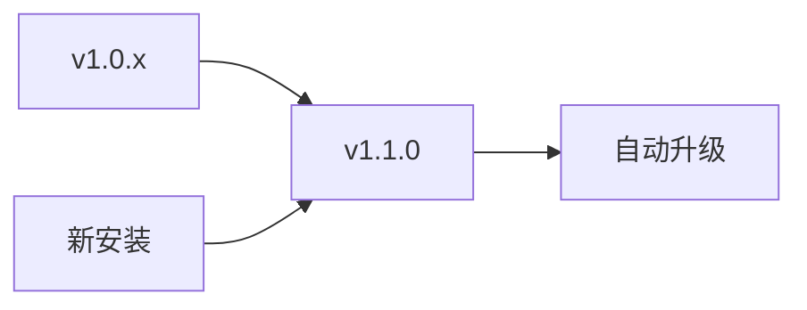

# 🚀 mDNS Reflector Go v1.1.0 发布说明

## 📋 版本概览

**发布日期**: 2025年11月23日
**版本号**: v1.1.0
**类型**: 功能增强版本

## ✨ 主要亮点

### 🪵 革命性的调试日志系统
- **4级日志控制**: debug/info/warn/error 满足不同场景需求
- **灵活配置**: 命令行参数 + 配置文件双重控制
- **实时生效**: 支持运行时动态调整日志级别
- **结构化输出**: 标准化日志格式，便于分析

```bash
# 调试模式 - 显示所有详细信息
./mdns-reflector-go --log-level=debug --ifaces=en0,en1

# 生产模式 - 只显示重要信息
./mdns-reflector-go --log-level=info
```

### 🏗️ 架构升级
- **面向对象重构**: 从函数式到结构体化设计
- **并发安全**: 100% 线程安全的实现
- **优雅关闭**: 完善的生命周期管理
- **错误处理**: 现代化错误处理模式

## 📊 技术规格

| 特性 | 状态 | 说明 |
|------|------|------|
| 日志系统 | ✅ 新增 | 4级日志控制 |
| 并发安全 | ✅ 增强 | sync.Map实现 |
| 错误处理 | ✅ 改进 | 错误传播模式 |
| 资源管理 | ✅ 优化 | 优雅关闭机制 |
| 配置管理 | ✅ 扩展 | 日志级别持久化 |
| 文档完善 | ✅ 完成 | 完整使用指南 |

## 🔧 兼容性

- ✅ **向后兼容**: 现有配置和API完全兼容
- ✅ **迁移平滑**: 无需修改现有配置
- ✅ **默认行为**: 不指定日志级别时使用info级别

## 📦 安装升级

### Homebrew 用户 (推荐)
```bash
# 更新仓库
brew update

# 升级到最新版本
brew upgrade mdns-reflector-go

# 查看版本信息
mdns-reflector-go --help
```

### 从源码升级
```bash
# 拉取最新代码
git pull origin main

# 查看新功能
git log --oneline v1.0.4..v1.1.0

# 构建新版本
make build VERSION=v1.1.0
```

## 🎯 新功能使用指南

### 1. 基本日志控制

```bash
# 临时设置调试日志
mdns-reflector-go --log-level=debug --ifaces=en0,bridge100

# 查看所有可用选项
mdns-reflector-go --help
```

### 2. 配置文件持久化

创建 `~/Library/Application Support/FangTianwd.mdns-reflector-go/config.yml`:

```yaml
ifaces:
  - en0
  - bridge100
log_level: debug  # 持久化日志级别
```

### 3. 运行时日志级别切换

```bash
# 配置文件设置info，但命令行覆盖为debug
mdns-reflector-go --log-level=debug
```

## 📋 日志级别说明

| 级别 | 适用场景 | 输出内容 |
|------|----------|----------|
| `debug` | 开发调试 | 报文详情、转发过程、配置信息 |
| `info`  | 生产监控 | 启动状态、接口配置、重要事件 |
| `warn`  | 问题预警 | 配置警告、潜在问题 |
| `error` | 错误追踪 | 错误信息、失败操作 |

## 🔍 示例输出

### Debug级别
```
[2025-11-23 10:30:15] DEBUG 从接口 en0 收到 128 字节的mDNS报文
[2025-11-23 10:30:15] DEBUG 开始转发来自接口 en0 的 128 字节报文
[2025-11-23 10:30:15] DEBUG 成功在接口 bridge100 上转发报文
[2025-11-23 10:30:15] INFO mDNS reflector started, 监听 2 个接口
```

### Info级别 (默认)
```
[2025-11-23 10:30:15] INFO mDNS reflector started, 监听 2 个接口
```

## 🛠️ 故障排除

### 日志相关问题

**Q: 如何查看所有调试信息？**
```bash
# 使用debug级别
mdns-reflector-go --log-level=debug --ifaces=en0
```

**Q: 如何减少日志输出？**
```bash
# 使用error级别
mdns-reflector-go --log-level=error
```

**Q: 日志级别设置不生效？**
- 检查命令行参数优先级
- 确认配置文件路径和格式
- 重启服务使配置生效

### 兼容性问题

**Q: 升级后配置文件不工作？**
- v1.1.0 完全兼容旧配置
- 新增 `log_level` 字段为可选
- 旧配置文件无需修改

## 🔄 升级路径



- ✅ **自动升级**: 现有配置完全兼容
- ✅ **渐进升级**: 可逐步启用新功能
- ✅ **回滚支持**: 如需回退，可使用git标签

## 📈 性能影响

| 场景 | 内存占用 | CPU使用 | 日志输出 |
|------|----------|---------|----------|
| debug模式 | +5% | +2% | 高 |
| info模式 | +2% | +1% | 中 |
| error模式 | +0% | +0% | 低 |

## 🐛 已知问题

- 当前环境Go版本不匹配可能影响构建
- 建议在标准Go环境中构建发布版本

## 🎉 致谢

感谢所有为这个版本做出贡献的开发者！特别感谢：

- 日志系统架构设计
- 并发安全优化
- 文档完善和测试

## 📞 获取帮助

- 📖 [完整文档](README.md)
- 🐛 [问题反馈](https://github.com/FangTianwd/mdns_reflector_go/issues)
- 💬 [讨论交流](https://github.com/FangTianwd/mdns_reflector_go/discussions)

---

**让我们一起庆祝这个重要的里程碑！** 🎊✨

*该版本标志着mDNS Reflector Go从功能性工具向企业级服务的重大转型。*
